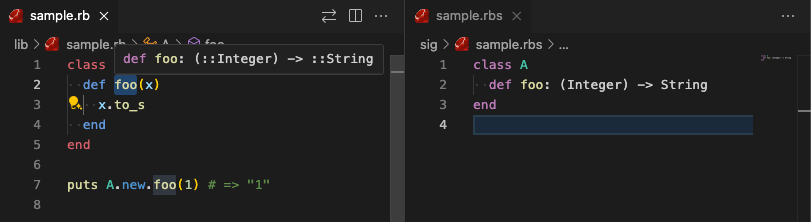

# Minimal Steep Sample

This is a minimal sample to verify the behavior of Steep.
It can also be used as a template to present a reproduction environment when a bug is found.

- `bundle`
- `bundle exec steep check`
- `ruby lib/sample.rb`

